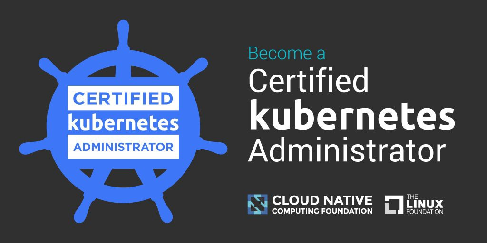

# Kubernetes-Certified-Administrator -  CKA

  

I have prepared the online resources that will 100% help you in preparation to take the Certified Kubernetes Administrator (CKA) certification exam. These resources are collected based on the exam experience. 

## CKA 2022 Exam Curriculum

I strongly recommend you to review and understand the exam objectives. 

* [CNCF Exam Curriculum repository ](https://github.com/cncf/curriculum)

## About the Exam

The CKA is not a multiple choice question, that is, it is not possible to choose a random answer or to choose the least wrong answer. The CKA is a practical exam where you are given 17 problems to solve within 2 hours. You can go from one problem to the other and you can flag them to come back to them later if you're not sure of the answer.

It is recommeded that you must start your exam before 15 minutes. Protector checks your room, desk etc where you are sitting. Also, don't wear smart watch or any other electronics device. You can use external monitor along with your laptop. 

Also, you may bookmark kubernetes documentation. This will surely help you in searching some YAML/imperative commands. I can provide my bookmarks if you needed, send me email to ravi.hackworks@gmail.com

## Passing Score

66% marks are needed to pass this certification.

